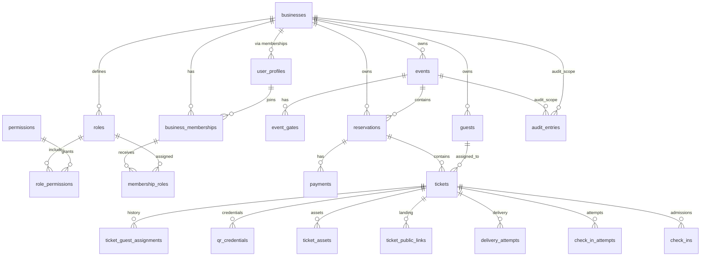

# Objetivo

Este documento define el modelo relacional de EntryFlow para una futura implementación en PostgreSQL y Supabase.

Es una especificación de base de datos, no SQL ejecutable.

Define:

- tablas
- columnas
- relaciones
- restricciones
- índices
- aislamiento por tenant
- estrategia de auditoría
- límites de datos sensibles
- comportamiento de borrado y retención

---

# Approved design decisions

1. Un `guest` puede reutilizarse entre eventos dentro del mismo `business`.
2. Un `ticket` almacena una captura inmutable de los datos del invitado asignado para ese evento.
3. Una `reservation` puede tener múltiples `payment` records.
4. `payment` soporta montos parciales, ajustes y reembolsos.
5. La rotación de `qr` es requerida cuando:
   - un `ticket` entregado se transfiere a otra persona
   - se sospecha compartición o fraude
   - un operador autorizado solicita invalidación
6. Una corrección ortográfica simple no requiere rotación automática de `qr`.
7. Cinco `tickets` por `reservation` es configurable y nunca hard-coded.
8. `check-ins` y `audit` son append-only.
9. Los registros operativos no se eliminan físicamente en uso normal.
10. Todo registro propiedad del tenant debe incluir `business_id` directamente o mediante una ruta de ownership aplicable.

---

# General database conventions

- Motor: PostgreSQL.
- Claves primarias: `uuid`.
- Tiempos operativos: `timestamptz`.
- Campos estándar:
  - `created_at`
  - `updated_at` cuando aplique
  - `created_by`
  - `updated_by` cuando aplique
- Los estados usan columnas `status` con restricciones explícitas.
- `metadata` usa `jsonb` solo para extensibilidad no crítica.
- Las claves foráneas deben ser explícitas.
- Las reglas de unicidad deben ser explícitas.
- Los `check constraints` deben proteger invariantes.
- Los índices parciales deben usarse donde agreguen valor.
- El borrado físico solo se justifica en entidades de configuración no críticas.
- Las tablas de hechos históricos deben ser append-only.

`jsonb` nunca debe reemplazar datos relacionales que tengan significado de negocio estable.

---

# V1 required tables

| Tabla | Estado |
|---|---|
| `businesses` | Required for MVP |
| `user_profiles` | Required for MVP |
| `business_memberships` | Required for MVP |
| `roles` | Required for MVP |
| `permissions` | Required for MVP |
| `role_permissions` | Required for MVP |
| `membership_roles` | Required for MVP |
| `business_settings` | Required for MVP |
| `events` | Required for MVP |
| `event_gates` | Required for MVP |
| `guests` | Required for MVP |
| `reservations` | Required for MVP |
| `payments` | Required for MVP |
| `tickets` | Required for MVP |
| `ticket_guest_assignments` | Required for MVP |
| `qr_credentials` | Required for MVP |
| `ticket_assets` | Required for MVP |
| `ticket_public_links` | Required for MVP |
| `delivery_attempts` | Required for MVP |
| `check_in_attempts` | Required for MVP |
| `check_ins` | Required for MVP |
| `audit_entries` | Required for MVP |
| `event_templates` | Required before production |
| `design_templates` | Required before production |
| `devices` | Required before production |
| `incident_notes` | Required before production |
| `domain_outbox` | Required before production |
| `event_assignments` | Future |
| `operator_sessions` | Future |

---

# Identity and tenancy tables

## `businesses`

Represents a tenant business in EntryFlow.

Suggested columns:

- `id`
- `name`
- `slug`
- `status`
- `timezone`
- `default_locale`
- `default_currency`
- `terminology_config`
- `privacy_config`
- `metadata`
- `created_at`
- `updated_at`

Constraints:

- unique `slug`
- valid `status`

Recommended status values:

- `active`
- `suspended`
- `archived`

## `user_profiles`

Application-level user profile linked to future Supabase Auth.

Suggested columns:

- `id`
- `display_name`
- `phone`
- `status`
- `created_at`
- `updated_at`

Clarification:

- authentication credentials belong to Supabase Auth, not this table.

## `business_memberships`

Associates users with businesses.

Suggested columns:

- `id`
- `business_id`
- `user_id`
- `status`
- `joined_at`
- `created_at`
- `updated_at`

Constraints:

- unique (`business_id`, `user_id`)

## `roles`

Represents permission groupings.

Suggested columns:

- `id`
- `business_id` nullable for system roles
- `code`
- `name`
- `description`
- `is_system`
- `status`
- `created_at`
- `updated_at`

## `permissions`

Represents atomic capabilities.

Suggested columns:

- `id`
- `code`
- `name`
- `description`

## `role_permissions`

Associates roles with permissions.

Suggested columns:

- `role_id`
- `permission_id`

Constraints:

- composite primary key or unique key on (`role_id`, `permission_id`)

## `membership_roles`

Associates a membership with one or more roles.

Suggested columns:

- `membership_id`
- `role_id`
- `event_id` nullable
- `assigned_at`
- `assigned_by`

Clarification:

- `event_id` nullable supports future per-event assignment.
- When `event_id` is null, the role applies at business scope.

---

# Business configuration tables

## `business_settings`

Stores operational defaults and configuration for a business.

Recommended conceptual fields:

- `id`
- `business_id`
- `terminology_config`
- `privacy_config`
- `operational_defaults`
- `reservation_defaults`
- `metadata`
- `created_at`
- `updated_at`

Typical use:

- default ticket count per reservation
- required guest fields
- privacy rules
- operational vocabulary

## `event_templates`

Stores reusable operational templates for events.

Recommended conceptual fields:

- `id`
- `business_id`
- `name`
- `description`
- `template_config`
- `status`
- `created_at`
- `updated_at`

Use cases:

- cloneable event presets
- default timings
- default policies

## `design_templates`

Stores reusable visual templates for Ticket assets.

Suggested columns:

- `id`
- `business_id`
- `event_id` nullable
- `name`
- `purpose`
- `version`
- `width`
- `height`
- `asset_source_path`
- `placeholder_schema`
- `status`
- `created_by`
- `created_at`
- `updated_at`
- `archived_at` nullable

Purposes:

- `whatsapp_entry`
- `instagram_story`
- `downloadable_entry`
- `ticket_landing`

Clarification:

- `placeholder_schema` may use `jsonb` because it describes layout configuration, not core business facts.

---

# Event tables

## `events`

Represents a presential event.

Suggested columns:

- `id`
- `business_id`
- `template_id` nullable
- `name`
- `description`
- `status`
- `event_date`
- `doors_open_at`
- `starts_at`
- `ends_at`
- `timezone`
- `capacity`
- `reservations_enabled`
- `qr_enabled`
- `partial_arrivals_enabled`
- `default_tickets_per_reservation`
- `max_tickets_per_reservation` nullable
- `official_design_template_id` nullable
- `metadata`
- `created_by`
- `created_at`
- `updated_at`
- `published_at` nullable
- `check_in_enabled_at` nullable
- `started_at` nullable
- `finished_at` nullable
- `cancelled_at` nullable
- `archived_at` nullable

Recommended status values:

- `draft`
- `published`
- `check_in_enabled`
- `live`
- `finished`
- `archived`
- `cancelled`

Constraints:

- status must follow the approved lifecycle
- `capacity` must be positive
- if `max_tickets_per_reservation` exists, it must be positive

## `event_gates`

Represents physical or logical access points for an event.

Suggested columns:

- `id`
- `business_id`
- `event_id`
- `name`
- `code`
- `status`
- `created_at`
- `updated_at`

Constraints:

- unique (`event_id`, `code`)

Recommended status values:

- `active`
- `inactive`
- `archived`

## `event_assignments`

Optional future-ready table for operator assignment.

Recommended use:

- future per-event assignment of operators to gates or roles

Recommendation:

- no need to include in v1 if operator assignment can be handled by memberships and session context
- keep as architectural preparation

---

# Guest tables

## `guests`

Represents a reusable person within one business.

Suggested columns:

- `id`
- `business_id`
- `full_name`
- `normalized_name`
- `identity_card_number`
- `identity_card_last4`
- `whatsapp_number`
- `normalized_whatsapp`
- `status`
- `metadata`
- `created_at`
- `updated_at`
- `archived_at` nullable

Rules:

- Guest is scoped to one business.
- No global deduplication across businesses.
- Identity-card number is not assumed globally unique.
- Duplicate warning is preferable to a hard unique constraint at first.
- Full identity-card data is sensitive.
- `identity_card_last4` supports masked operational display.
- Full values must never appear in logs or public assets.

Recommended duplicate-warning strategy:

- warn on repeated `identity_card_number` within a business when present
- warn on repeated `normalized_whatsapp` within a business when present
- do not block silently unless policy requires it later

Sensitive storage recommendation:

- protect full sensitive values using database access controls and, in a later security phase, field-level encryption or equivalent protected storage

---

# Reservation tables

## `reservations`

Represents an operational reservation attached to an event.

Suggested columns:

- `id`
- `business_id`
- `event_id`
- `holder_name`
- `holder_whatsapp`
- `reservation_code`
- `source`
- `status`
- `payment_status_summary`
- `ticket_count`
- `checked_in_count`
- `pending_count`
- `cancelled_count`
- `internal_notes`
- `metadata`
- `created_by`
- `created_at`
- `updated_at`
- `cancelled_at` nullable
- `finished_at` nullable

Constraints:

- unique (`event_id`, `reservation_code`)
- ticket counts cannot be negative
- aggregate counts must not exceed `ticket_count`

Clarification:

- aggregate counts are cached summaries
- operational truth remains in `tickets`

Reservation sources:

- `manual`
- `whatsapp`
- `instagram`
- `web`
- `courtesy`
- `physical_window_future`

`physical_window_future` is a future source only; no dedicated v1 workflow exists yet.

---

# Payment tables

## `payments`

One reservation may have multiple payment records.

Suggested columns:

- `id`
- `business_id`
- `reservation_id`
- `type`
- `status`
- `amount`
- `currency`
- `method`
- `external_reference` nullable
- `proof_path` nullable
- `paid_at` nullable
- `verified_at` nullable
- `verified_by` nullable
- `notes`
- `created_by`
- `created_at`
- `updated_at`

Payment types:

- `charge`
- `adjustment`
- `refund`

Payment statuses:

- `pending`
- `partial`
- `paid`
- `rejected`
- `refunded`

Clarification:

- reservation payment summary is derived from payment records
- v1 does not implement POS, invoicing or cash reconciliation

---

# Ticket tables

## `tickets`

Ticket is an independent aggregate.

Suggested columns:

- `id`
- `business_id`
- `event_id`
- `reservation_id`
- `current_guest_id` nullable
- `ticket_code`
- `status`
- `sequence_number`
- `assigned_name_snapshot`
- `assigned_identity_card_snapshot`
- `assigned_identity_card_last4`
- `assigned_whatsapp_snapshot`
- `active_qr_credential_id` nullable
- `latest_whatsapp_asset_id` nullable
- `latest_story_asset_id` nullable
- `latest_downloadable_asset_id` nullable
- `checked_in_at` nullable
- `cancelled_at` nullable
- `blocked_at` nullable
- `expires_at` nullable
- `metadata`
- `created_by`
- `created_at`
- `updated_at`

Constraints:

- unique (`event_id`, `ticket_code`)
- unique (`reservation_id`, `sequence_number`)
- status follows approved lifecycle
- `checked_in_at` must be consistent with checked-in status

Snapshot strategy:

- `current_guest_id` links to the reusable `guests` row.
- snapshot fields preserve exactly what was assigned to this ticket at the relevant operational moment.
- historical assignment changes are stored separately.
- public representations read the current approved assignment.

## `ticket_guest_assignments`

Append-oriented assignment history.

Suggested columns:

- `id`
- `business_id`
- `ticket_id`
- `guest_id` nullable
- `assigned_name`
- `assigned_identity_card`
- `assigned_identity_card_last4`
- `assigned_whatsapp`
- `assignment_type`
- `reason`
- `assigned_by`
- `assigned_at`
- `ended_at` nullable
- `replaced_by_assignment_id` nullable

Assignment types:

- `initial`
- `correction`
- `transfer`
- `administrative`

Safe current assignment rule:

- one active assignment is identified by `ended_at is null`
- enforce a partial unique index on `ticket_id` where `ended_at is null`

Clarification:

- `reservation` is not `ticket`
- `guest` is not `ticket`
- `qr` is not `ticket`
- `ticket_asset` is not `ticket`

---

# QR credential tables

## `qr_credentials`

Suggested columns:

- `id`
- `business_id`
- `event_id`
- `ticket_id`
- `token_hash`
- `token_prefix` nullable
- `status`
- `version`
- `issued_at`
- `activated_at` nullable
- `invalidated_at` nullable
- `invalidation_reason` nullable
- `rotated_from_id` nullable
- `created_by`
- `created_at`

Rules:

- store a secure token hash rather than raw token storage when feasible
- only one active credential per ticket
- previous credentials remain recorded but invalid
- QR contains an opaque token only
- never include name, identity-card number or WhatsApp in the QR

Recommended constraints:

- unique `token_hash`
- partial unique index on `ticket_id` where `status = 'active'`

Statuses:

- `generated`
- `active`
- `rotated`
- `invalidated`
- `archived`

## `ticket_public_links`

Represents safe landing-page access for a ticket.

Suggested columns:

- `id`
- `business_id`
- `ticket_id`
- `access_token_hash`
- `status`
- `expires_at` nullable
- `created_at`
- `invalidated_at` nullable

Clarification:

- `ticket_public_links` is not the same as a QR credential
- public landing access uses a constrained token-based path
- the QR credential is for scanning and validation

Recommended behavior:

- public landing links should be rotatable and, preferably, expirable

---

# Ticket experience and asset tables

## `ticket_assets`

Suggested columns:

- `id`
- `business_id`
- `event_id`
- `ticket_id`
- `design_template_id`
- `type`
- `version`
- `status`
- `storage_path`
- `public_access_mode`
- `rendered_name`
- `qr_credential_id` nullable
- `generation_context`
- `generated_by`
- `generated_at`
- `delivered_at` nullable
- `archived_at` nullable
- `supersedes_asset_id` nullable

Types:

- `whatsapp_entry`
- `instagram_story`
- `downloadable_entry`
- `landing_preview`
- `wallet_future`
- `pdf_future`

Rules:

- Instagram Story assets must not contain QR.
- No asset contains identity-card number.
- Assets are versioned.
- Regeneration creates a new record rather than overwriting.
- Older versions may be archived.
- Ticket identity is unchanged.

`generation_context` may use `jsonb` because it contains render configuration, not core business facts.

## `design_templates`

See business configuration tables. It is referenced here because it drives asset generation.

---

# Communication tables

## `delivery_attempts`

Suggested columns:

- `id`
- `business_id`
- `event_id`
- `reservation_id` nullable
- `ticket_id` nullable
- `asset_id` nullable
- `channel`
- `recipient`
- `normalized_recipient`
- `status`
- `message_template_code`
- `provider`
- `provider_message_id` nullable
- `provider_response`
- `requested_by`
- `requested_at`
- `sent_at` nullable
- `delivered_at` nullable
- `failed_at` nullable
- `failure_reason` nullable

Rules:

- one record per attempt
- never overwrite failed attempts
- manual WhatsApp-link use can still create a record
- provider delivery confirmation remains future-dependent

Statuses:

- `pending`
- `queued`
- `sent`
- `delivered`
- `failed`
- `cancelled`

`provider_response` should be sanitized and, if full payload retention is ever needed, stored with strict controls.

---

# Check-in tables

## `check_in_attempts`

Every scan or manual validation attempt.

Suggested columns:

- `id`
- `business_id`
- `event_id`
- `ticket_id` nullable
- `qr_credential_id` nullable
- `gate_id` nullable
- `operator_user_id`
- `device_id` nullable
- `method`
- `result`
- `reason`
- `attempted_at`
- `metadata`

Methods:

- `qr_scan`
- `manual_search`
- `manual_admission`
- `supervisor_override`

Results:

- `valid`
- `admitted`
- `duplicate`
- `cancelled`
- `blocked`
- `invalid`
- `wrong_event`
- `finished_event`
- `rejected`
- `resolved`

## `check_ins`

Successful admission facts only.

Suggested columns:

- `id`
- `business_id`
- `event_id`
- `ticket_id`
- `attempt_id`
- `gate_id` nullable
- `operator_user_id`
- `method`
- `admitted_at`
- `override_approved_by` nullable
- `reason` nullable
- `created_at`

Rules:

- append-only
- no update or delete in normal operation
- recommend one normal successful check-in per ticket
- exceptional repeat admission requires a new check-in with supervisor approval and explicit reason
- ticket checked-in summary is derived from these facts

Recommended constraints:

- unique partial index on `ticket_id` for normal admissions
- exceptional admissions allowed only when explicitly marked and approved

---

# Audit tables

## `audit_entries`

Audit is first-class and append-only.

Suggested columns:

- `id`
- `business_id`
- `event_id` nullable
- `actor_user_id` nullable
- `actor_membership_id` nullable
- `actor_role_code` nullable
- `entity_type`
- `entity_id`
- `action`
- `previous_state`
- `new_state`
- `changed_fields`
- `reason`
- `source`
- `device_id` nullable
- `ip_address` nullable
- `occurred_at`
- `correlation_id` nullable
- `metadata`

Rules:

- never update or delete in normal operation
- avoid duplicating complete sensitive values unnecessarily
- sensitive changes may store redacted or hashed representations
- every sensitive action creates an entry
- state transitions create entries
- check-in facts and audit are related but are not substitutes for each other

Audit is a first-class module, not a secondary log file.

---

# Optional operational tables

## `devices`

Represents an operator device or scanner endpoint.

Recommended use:

- track scanner hardware
- support audit attribution
- support incident resolution

Status:

- future or required before production, depending on the rollout

## `operator_sessions`

Represents operator session context.

Recommended use:

- quick lock
- session-expiry handling
- active station context

Status:

- future

## `incident_notes`

Represents a structured note tied to an operational incident.

Recommended use:

- supervisor notes
- exception explanations
- operational follow-up

Status:

- required before production if incident workflows are part of launch scope

---

# Derived data and reporting

Conceptual views or read models:

- `event_live_metrics`
- `reservation_ticket_summary`
- `payment_summary`
- `ticket_delivery_summary`
- `gate_activity_summary`
- `duplicate_scan_summary`
- `operator_activity_summary`

Rules:

- derived views do not own operational truth
- cached counters require reconciliation
- source facts remain in core tables

---

# Relationships

This diagram is conceptual. It is not SQL.

---

# Foreign-key and deletion policy

Recommended behavior:

- `RESTRICT` for core operational parents.
- No cascade deletion of `events`, `reservations`, `tickets`, `payments`, `check_ins` or `audit_entries`.
- `CASCADE` only for purely configurational join records where safe.
- Use archive/status transitions instead of physical deletion.
- Deleting an authentication user must not erase historical actor references; prefer nullable actor references plus immutable actor snapshots.

Major relationship strategy:

- `businesses` to operational tables: restrict deletion; archive instead.
- `events` to reservations, gates, tickets, audit, check-ins: restrict deletion.
- `reservations` to tickets and payments: restrict deletion.
- `tickets` to qr credentials, assets, delivery attempts, assignment history and check-in records: restrict deletion.
- `roles` and `permissions`: prefer status changes over deletes; join tables may be cleaned only when safe and non-historical.
- `audit_entries` and `check_ins`: never hard delete in normal use.

---

# Index strategy

Recommend indexes for:

- every foreign key
- `business_id + status`
- `event_id + status`
- `event_id + normalized_name`
- `reservation_code`
- `ticket_code`
- active QR token lookup
- identity-card search within a business
- normalized WhatsApp search
- check-in attempts by event and time
- check-ins by ticket
- audit by entity
- audit by event and timestamp
- delivery attempts by ticket and status
- pending tickets per event

Partial indexes where useful:

- active QR credentials
- pending tickets
- active events
- failed deliveries
- open assignments

Suggested examples:

- `qr_credentials` where `status = 'active'`
- `tickets` where `status in ('created', 'assigned', 'pending_send')`
- `events` where `status in ('published', 'check_in_enabled', 'live')`
- `delivery_attempts` where `status = 'failed'`
- `ticket_guest_assignments` where `ended_at is null`

---

# Constraint strategy

Recommended approach:

- Use `text` plus `check constraints` for lifecycle values that may evolve but are conceptually finite.
- Use database enums only if the value set is extremely stable and operationally safe to freeze.
- Enforce transactional state transitions in the application layer and back them with constraints where possible.
- Prevent negative amounts.
- Prevent invalid capacities.
- Prevent a `ticket` from belonging to another business than its `reservation` or `event`.
- Prevent cross-tenant foreign-key mistakes.
- Ensure active guest assignment uniqueness.
- Allow one active QR credential per ticket.
- Allow one current ticket asset per type when appropriate.
- Keep checked-in summary consistent with check-in facts.

### Composite tenant integrity

Recommended practical approach for Supabase/PostgreSQL:

- Every tenant-owned table must include `business_id`.
- Parent tables should have strong uniqueness on (`business_id`, `id`) or equivalent safe ownership paths.
- High-risk tables may use composite foreign keys on (`business_id`, `parent_id`) where the implementation cost is justified.
- Use RLS together with FK rules; do not rely on either alone.

This is the most practical balance between integrity and maintainability.

---

# Row Level Security preparation

Conceptual RLS rules:

- authenticated user sees data only for businesses where they have an active membership
- role and permission checks protect actions
- public Ticket landing access uses a constrained token-based path
- public users never query general `tickets` or `guests` tables directly
- Door sees only assigned event data
- sensitive fields may require restricted views or server-side functions
- audit access is limited
- inserts must enforce `business_id` derived from authorized context
- no client-provided `business_id` should be trusted without verification

Detailed policies will be specified separately before migration implementation.

---

# Sensitive-data strategy

- full name, carnet and WhatsApp are personal data
- carnet and WhatsApp are not included in QR
- carnet is masked by default
- Story assets exclude QR and carnet
- downloadable Ticket includes QR and name but never carnet
- logs must redact sensitive values
- backups and exports require controls
- retention policy remains an open production requirement
- exact encryption strategy must be decided before launch

Recommended provisional answer:

- store masked operational displays in relational columns
- protect full sensitive values with strict access control now
- decide on application-layer encryption or equivalent protected storage before production

---

# Transaction boundaries

## Create Reservation

Reservation, Tickets, initial Guest assignments and audit should succeed atomically.

## Confirm Payment

Payment record, payment summary and audit should succeed atomically.

## Transfer Ticket

New guest assignment, Ticket snapshot update, optional QR rotation request, audit and regeneration request must remain consistent.

## Rotate QR

Invalidate previous credential and activate new credential atomically.

## Confirm Check-in

Check-in attempt, successful check-in, Ticket summary and audit must remain consistent.

## Cancel Ticket

Ticket status, QR invalidation and audit must remain consistent.

External work that should happen after commit:

- image rendering
- WhatsApp sending
- analytics refresh

---

# Background work and outbox preparation

## `domain_outbox`

Conceptual columns:

- `id`
- `business_id`
- `event_type`
- `aggregate_type`
- `aggregate_id`
- `payload`
- `status`
- `attempts`
- `available_at`
- `created_at`
- `processed_at` nullable
- `last_error` nullable

Use cases:

- generate Ticket asset
- send WhatsApp
- refresh metrics
- notify after transfer
- process report

Recommendation:

- v1 may process this simply, without distributed infrastructure

---

# Migration sequencing

Recommended future migration order:

1. Identity and tenant foundation.
2. Roles and permissions.
3. Businesses and settings.
4. Events and gates.
5. Guests.
6. Reservations.
7. Payments.
8. Tickets and assignments.
9. QR credentials.
10. Designs and assets.
11. Deliveries.
12. Check-in attempts and Check-ins.
13. Audit.
14. Outbox.
15. Indexes and RLS.
16. Seed roles and permissions.

No migrations are created yet.

---

# Open decisions

## 1. Encryption method for identity-card number

**Recommendation:** protect full values now with strict access controls and decide the exact encryption strategy before production.

## 2. Guest duplicate detection uses carnet, WhatsApp or both

**Recommendation:** both, with business-level warnings rather than hard global uniqueness.

## 3. Holder is also modeled as a Guest

**Recommendation:** not as a hard requirement in v1; keep `holder_name` and `holder_whatsapp` as snapshots, and allow optional future linkage to `guest`.

## 4. Reservation payment status is stored or always derived

**Recommendation:** store a cached summary and derive it from `payments` as the source of truth.

## 5. Ticket snapshots include full carnet or only protected reference

**Recommendation:** include the full snapshot as protected data plus `identity_card_last4` for display, with strict access controls.

## 6. Public Ticket landing links expire

**Recommendation:** yes, preferably configurable and rotatable.

## 7. A successful Check-in can be reversed

**Recommendation:** no direct reversal; use explicit exceptional correction records instead.

## 8. How long old QR credentials remain queryable

**Recommendation:** keep them queryable internally for audit and investigation, while remaining invalid for access.

## 9. Ticket asset generation is synchronous or queued

**Recommendation:** queued through outbox-style processing after commit.

## 10. Provider responses are stored in full or sanitized

**Recommendation:** sanitized by default; full raw payload only if strictly necessary and protected.

---

# Consistency review

Comparison against existing documents:

- **PRODUCT_VISION.md**: coherent. This design preserves the focus on event operations and avoids turning EntryFlow into a generic ERP or CRM.
- **DOMAIN_MODEL.md**: coherent. Entities such as business, event, reservation, ticket, guest, check-in, user, role and history map cleanly to tables.
- **EVENT_OPERATION.md**: coherent. Operational flows such as transfer, QR rotation, duplicate handling and manual admission are represented in the schema.
- **TICKET_SYSTEM.md**: coherent. Ticket identity, QR separation, assets and representations are modeled independently.
- **USER_OPERATIONS.md**: coherent. User, role, permission and sensitive-action auditing are represented through identity and access tables.
- **STATE_MACHINE.md**: coherent. State-driven behavior is captured through `status` columns, timestamps and lifecycle constraints.
- **SYSTEM_ARCHITECTURE.md**: coherent. Module boundaries map to relational ownership and preserve multi-tenant constraints.

### Findings

- **True contradiction found:** none.
- **Added detail, not contradiction:** this document makes `guest` reusable within a business, which is consistent with the system architecture recommendation.
- **Added detail, not contradiction:** `check_in_attempts` and `check_ins` are split into attempt facts and successful admission facts, which extends the operational model without changing it.
- **Added detail, not contradiction:** `domain_outbox` is a new infrastructure support table, consistent with the architecture document.

### Fields that may be unnecessary or candidates for later refinement

- `reservations.payment_status_summary` if the system later decides to derive it entirely on read.
- `tickets.latest_whatsapp_asset_id`, `latest_story_asset_id` and `latest_downloadable_asset_id` if a separate latest-version query becomes preferred.
- `provider_response` if future compliance prefers only sanitized structured fields.

These are not contradictions. They are candidates for later simplification review.

