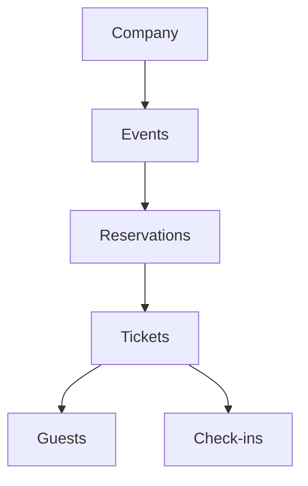

# DOMAIN MODEL

## Objetivo

Este documento define las entidades reales del negocio de EntryFlow de forma independiente a la interfaz, a las pantallas y a la implementación técnica.

Las páginas, componentes y vistas pueden evolucionar con el tiempo, pero el modelo de negocio debe permanecer estable para mantener consistencia conceptual, trazabilidad y escalabilidad entre empresas.

---

# Empresa

La **Empresa** representa un negocio que utiliza EntryFlow.

Ejemplos:

- Restaurante
- Discoteca
- Festival
- Productora

Una empresa puede tener muchos eventos.

La empresa funciona como contenedor principal de operación, configuración y contexto comercial.

---

# Evento

El **Evento** es la entidad central del dominio.

Todo comienza con un Evento.

Un evento representa una operación presencial concreta: una fecha, una experiencia, un conjunto de reglas y un flujo operativo definido.

### Ciclo de vida

El evento evoluciona a lo largo de un ciclo operativo claro:

- **Draft**: el evento está en preparación. Se configuran datos, reglas, capacidad y condiciones operativas.
- **Published**: el evento ya fue publicado y está disponible para ser operado. Puede comenzar a recibir reservas y confirmaciones.
- **Live**: el evento está en curso. La operación de puerta, el check-in y el seguimiento en tiempo real pasan a ser prioritarios.
- **Finished**: el evento concluyó y no se espera más actividad operativa directa.
- **Cancelled**: el evento fue cancelado. Esta condición puede aplicarse desde cualquier estado.

### Significado operativo

El estado del evento determina qué acciones están permitidas, qué información se muestra al equipo y qué tipo de seguimiento requiere la operación.

El evento no es solo una fecha en calendario. Es la unidad principal de trabajo dentro de EntryFlow.

---

# Reserva

La **Reserva** pertenece a un Evento.

La reserva representa una intención o compromiso de asistencia dentro de una operación específica, pero no equivale al acceso final.

Una reserva tiene:

- titular de la reserva
- estado de pago
- notas
- uno o más Tickets

La reserva **NO es** el ticket.

La reserva agrupa información comercial y operativa previa al acceso. Los tickets representan admisiones individuales.

---

# Ticket

El **Ticket** representa una admisión individual.

Cada ticket tiene:

- identificador único
- QR
- nombre del invitado
- estado actual
- estado de ingreso
- historial

El QR pertenece al Ticket.

No pertenece a la Reserva.

El ticket es la unidad de control operativa en el acceso y en el check-in. Puede existir en distintos estados y debe conservar trazabilidad completa de su ciclo.

---

# Invitado

El **Invitado** representa a la persona asignada a un Ticket.

La persona asignada puede cambiar antes del evento sin necesidad de crear un ticket nuevo.

Cambiar el invitado no debe obligar a generar una nueva admisión.

El invitado es la identidad operativa asociada al acceso. Su vínculo con el ticket debe poder actualizarse manteniendo el historial del cambio.

---

# Check-in

El **Check-in** representa un evento operativo registrado durante la operación.

Debe almacenar:

- fecha
- operador
- puerta
- dispositivo
- observaciones

El check-in debe conservar historial.

Nunca debe sobrescribirse.

Cada registro de check-in representa una acción operativa real y debe permanecer como evidencia trazable del movimiento de un ticket o invitado dentro del evento.

---

# Usuario

El **Usuario** representa a una persona que accede a la plataforma.

Ejemplos:

- Administrator
- Reception
- Door
- Supervisor

El usuario existe en el nivel de acceso al sistema y no debe confundirse con el invitado del evento.

---

# Rol

El **Rol** define permisos independientes de los usuarios.

Los usuarios pueden cambiar de rol.

El rol determina qué puede ver o hacer cada usuario dentro de la plataforma, sin quedar atado permanentemente a la identidad de una persona.

---

# Historial

EntryFlow nunca elimina información operativa importante.

Todo lo relevante se convierte en historial.

Ejemplos:

- Transferencia de invitado
- Ticket cancelado
- QR regenerado
- Check-in
- Check-out (future)

El historial es una pieza esencial del dominio porque permite trazabilidad, auditoría y reconstrucción de la operación completa.

---

# Entity relationships

Relación conceptual del dominio:

Empresa

↓

Eventos

↓

Reservas

↓

Tickets

↓

Invitados

↓

Check-ins

La dirección de esta relación refleja el flujo de dependencia del negocio, desde la empresa hasta la evidencia operativa de ingreso.

---

# Product Rules

Reglas de negocio identificadas hasta ahora:

- Todo comienza con un Evento.
- Reservation != Ticket.
- El QR pertenece al Ticket.
- El historial del Ticket es inmutable.
- El Invitado puede cambiar antes del check-in.
- Nunca eliminar datos operativos.
- Una Empresa puede tener muchos Eventos.
- Un Ticket representa una admisión individual.
- Un Check-in nunca debe sobrescribirse.
- La relación entre Reserva, Ticket e Invitado debe conservar trazabilidad.
- El modelo de negocio debe permanecer estable aunque la interfaz cambie.

Estas reglas definen la base conceptual de EntryFlow y protegen el producto contra desviaciones hacia modelos genéricos que diluyan su foco operativo.

