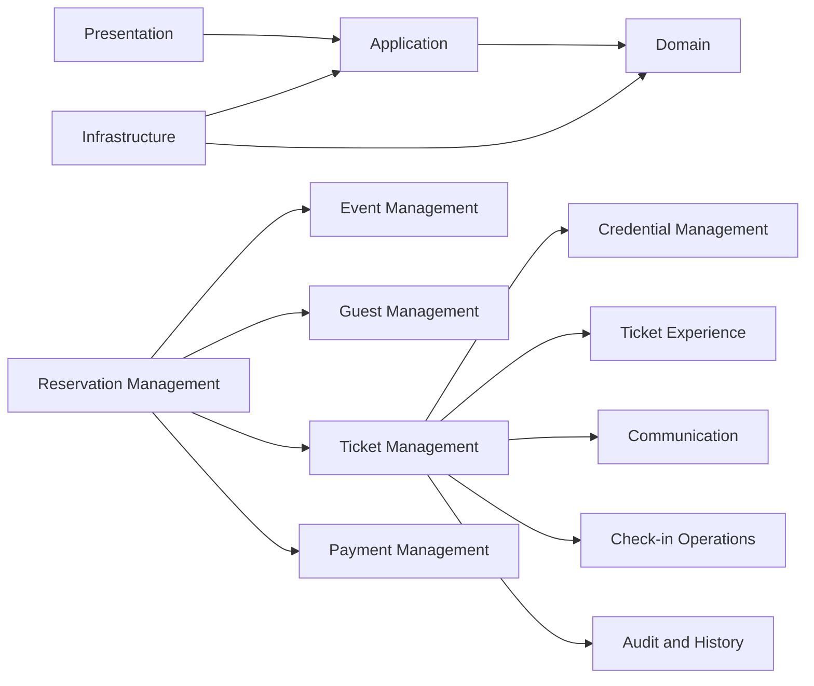

# Objetivo

Este documento traduce el modelo de producto y operación de EntryFlow en una arquitectura modular antes de definir base de datos o implementación.

La arquitectura debe soportar:

- operación multiempresa
- flujos centrados en eventos
- Tickets individuales
- invitados con nombre
- números de documento de identidad
- entrega individual por WhatsApp
- pagos
- validación por QR
- assets visuales del Ticket
- check-in
- permisos
- historial de auditoría inmutable
- venta futura de tickets físicos sin implementarla ahora

---

# Principios arquitectónicos

1. Multi-tenant por diseño.
2. Dominio centrado en el Evento.
3. El Ticket es la entidad central de admisión.
4. El QR solo identifica al Ticket.
5. Los assets visuales son representaciones del Ticket.
6. El estado actual y el historial inmutable coexisten.
7. Las acciones sensibles se protegen con permisos y auditoría.
8. Los módulos deben tener responsabilidades claras.
9. Las reglas de negocio no deben depender de páginas de UI.
10. Las integraciones futuras no deben redefinir las entidades núcleo.
11. La venta física de tickets es alcance futuro, no alcance de v1.
12. La reserva típica de cinco Tickets es configurable, no fija.

Estos principios mantienen la arquitectura coherente con la visión, el dominio y la operación real.

---

# Arquitectura de alto nivel

## Presentation

Responsabilidades:

- dashboard web
- interfaz operativa responsive para móviles
- landing page pública del Ticket
- interfaz de escáner
- solicitudes de generación de assets visuales
- interfaz en español
- personalización futura de terminología por negocio

Presentation invoca casos de uso, pero no posee reglas de negocio.

Su función es capturar intención operativa y mostrar resultados, no decidir estados ni validar invariantes de dominio.

## Application

Responsabilidades:

- orquestar casos de uso
- validar permisos
- validar estado actual
- coordinar módulos de dominio
- iniciar transacciones
- publicar eventos de dominio
- devolver resultados operativos

Ejemplos:

- CreateEvent
- PublishEvent
- CreateReservation
- ConfirmPayment
- GenerateTickets
- TransferTicket
- RotateTicketQr
- SendTicket
- ValidateCheckIn
- ConfirmCheckIn
- CancelTicket
- FinishEvent

Application coordina el flujo. No contiene reglas de negocio persistentes.

## Domain

Responsabilidades:

- entidades
- agregados
- value objects
- transiciones de estado
- validación de invariantes
- eventos de dominio
- políticas de negocio

El Domain debe permanecer independiente de Next.js, Supabase, WhatsApp y bibliotecas de QR.

## Infrastructure

Responsabilidades:

- persistencia de datos
- autenticación
- almacenamiento de archivos
- generación de QR
- renderizado de imágenes
- integración con WhatsApp
- almacenamiento de auditoría
- jobs en segundo plano
- despliegue
- monitoreo

Supabase es una elección de infraestructura, no el modelo de negocio.

---

# Módulos

## Business Management

Propietario de:

- Business
- configuración del negocio
- branding
- preferencias de terminología
- políticas por defecto
- plantillas de evento
- plantillas oficiales de diseño

Responsabilidades:

- aislar datos por tenant
- configurar cantidad por defecto de Tickets por Reserva
- configurar campos obligatorios de invitado
- configurar vocabulario operativo
- configurar reglas de privacidad

## Identity and Access

Propietario de:

- User
- Role
- Permission
- BusinessMembership
- EventAssignment
- contexto de sesión

Responsabilidades:

- autenticación
- autorización
- mínimo privilegio
- acceso por negocio
- asignación futura por evento
- aprobación de acciones sensibles

## Event Management

Propietario de:

- Event
- EventPolicy
- Gate
- capacidad
- ciclo de vida
- fechas y horas
- disponibilidad de reservas
- política QR
- política de llegadas parciales

Responsabilidades:

- crear y configurar Eventos
- publicar
- habilitar check-in
- iniciar
- finalizar
- cancelar
- archivar
- prevenir transiciones inválidas

Consideraciones futuras:

- mesas
- sectores
- listas de espera
- plantillas de evento

## Reservation Management

Propietario de:

- Reservation
- titular de la reserva
- WhatsApp principal
- origen
- notas
- conteos agregados de Tickets
- estado de la Reserva

Responsabilidades:

- crear Reserva
- asociarla a un Evento
- administrar información del titular
- agregar o reducir Tickets no utilizados
- rastrear estado agregado de admisión
- preservar historial de cancelación

Orígenes de Reserva:

- Manual
- WhatsApp
- Instagram
- Web
- Courtesy
- Physical Window, future

Physical Window es un origen futuro y no tiene flujo v1 dedicado.

## Guest Management

Propietario de:

- Guest
- nombre completo
- número de documento de identidad
- WhatsApp individual
- datos de contacto
- datos sensibles de identidad

Responsabilidades:

- registrar invitado
- actualizar información del invitado
- preservar asignaciones históricas
- soportar transferencias de Ticket
- enmascarar datos sensibles según permiso

### Recomendación de alcance inicial

La opción más segura es que **Guest** se reutilice dentro de una misma **Business** y no sea global entre negocios.

Esto significa:

- reutilizable entre Eventos de una misma empresa
- no compartido por defecto entre empresas distintas
- más simple para búsquedas, historial y privacidad

**Ventajas:**

- mejor deduplicación dentro del negocio
- historial más consistente
- menor exposición entre tenants

**Costo:**

- requiere normalizar mejor la identidad para evitar duplicados internos

## Ticket Management

Propietario de:

- Ticket
- asignación actual de invitado
- estado del Ticket
- identidad permanente del Ticket
- referencias al historial del Ticket
- reglas de admisión
- referencias a credenciales QR
- referencias a assets visuales

Responsabilidades:

- crear Ticket
- asignar invitado
- transferir Ticket
- cancelar
- bloquear
- reactivar
- rotar QR
- solicitar regeneración de assets
- mantener identidad permanente del Ticket

Clarificaciones:

- Reservation no es Ticket
- Guest no es Ticket
- QR no es Ticket
- Ticket asset no es Ticket

## Credential Management

Propietario de:

- credencial QR
- ciclo de vida del token QR
- credencial activa
- credenciales invalidadas
- historial de rotación

Responsabilidades:

- generar token
- activar token
- resolver token a Ticket
- invalidar token
- rotar token
- impedir reutilización del token antiguo

El QR nunca debe contener nombre completo, número de documento de identidad ni WhatsApp completos.

## Ticket Experience

Propietario de:

- configuración de landing del Ticket
- TicketAsset
- DesignTemplate
- AssetVersion
- representaciones visuales renderizadas

Representaciones:

- landing oficial del Ticket
- entrada por WhatsApp con QR
- historia de Instagram sin QR
- entrada descargable con QR
- futuros Wallet y PDF

Responsabilidades:

- combinar diseño + datos actuales del Ticket
- renderizar nombre, Evento, fecha, QR y branding
- regenerar después de cambios de invitado
- regenerar después de rotación de QR
- archivar versiones reemplazadas
- preservar qué versión fue entregada

## Payment Management

Propietario de:

- Payment
- estado del pago
- monto
- método
- fecha
- observaciones
- operador de verificación
- referencia futura a comprobante

Responsabilidades:

- registrar pago
- marcar parcial
- marcar pagado
- rechazar
- reembolsar
- preservar historial de pago
- exponer el estado actual del pago de la Reserva

v1 no implementa punto de venta ni facturación.

## Communication

Propietario de:

- DeliveryAttempt
- WhatsApp receptor
- alcance de Ticket o Reserva
- estado de entrega
- plantilla de mensaje
- marca de tiempo
- operador
- respuesta del proveedor cuando exista

Responsabilidades:

- enviar Ticket individual
- enviar todos los Tickets de una Reserva
- reenviar Ticket actualizado
- enviar después de una transferencia
- registrar entrega fallida
- soportar automatización futura

La integración automática de WhatsApp es trabajo futuro, pero la arquitectura debe soportarla.

## Check-in Operations

Propietario de:

- CheckIn
- CheckInAttempt
- Gate
- operador
- dispositivo
- resultado de validación
- resultado de admisión
- notas de incidente

Responsabilidades:

- escanear QR
- resolver Ticket
- validar estado
- detectar duplicados
- confirmar admisión
- registrar admisión manual
- rechazar admisión inválida
- preservar cada intento
- actualizar métricas en vivo

Check-in es append-only y nunca debe sobrescribir hechos operativos previos.

## Audit and History

Propietario de:

- AuditEntry
- actor
- rol
- negocio
- evento
- tipo de entidad
- id de entidad
- acción
- estado anterior
- estado nuevo
- motivo
- fuente
- dispositivo
- fecha y hora

Responsabilidades:

- registrar acciones sensibles
- registrar transiciones de estado
- preservar valores previos y nuevos
- soportar investigaciones
- soportar cumplimiento
- exponer líneas de tiempo por entidad

Audit es un módulo de primera clase, no un archivo de log secundario.

## Reporting

Propietario conceptual de read models para:

- métricas en vivo del Evento
- totales de Reserva
- Tickets emitidos
- Tickets ingresados
- Tickets pendientes
- Tickets cancelados
- Tickets transferidos
- intentos de duplicado
- admisiones manuales
- resúmenes de pago
- resúmenes de entrega

Reporting consume datos operativos, pero no los posee.

---

# Aggregates

## Business Aggregate

**Root:** Business

Contiene o referencia:

- settings
- terminology
- policies
- branding

Debe ser transaccionalmente consistente en configuraciones que afecten a todo el negocio.

## Event Aggregate

**Root:** Event

Contiene o referencia:

- EventPolicy
- Gates
- estado del ciclo de vida
- capacidad

Debe mantener consistencia transaccional para las reglas que determinan si el evento puede recibir reservas, check-ins o cierre.

## Reservation Aggregate

**Root:** Reservation

Contiene o referencia:

- titular
- estado de la Reserva
- referencias a Tickets
- resumen de pago

Los Tickets deberían ser agregados separados para escalabilidad y check-in independiente, mientras que los totales de la Reserva pueden derivarse o sincronizarse.

## Ticket Aggregate

**Root:** Ticket

Contiene o referencia:

- asignación actual de invitado
- estado actual
- referencia de credencial QR activa
- últimas referencias de asset
- resumen de check-in

El Ticket requiere consistencia independiente porque su admisión, transferencia y rotación de QR pueden ocurrir de forma aislada y concurrente.

## Payment Aggregate

**Root:** Payment

Relación con Reservation:

- una Payment pertenece a una Reservation
- el estado agregado de pago de la Reserva puede derivarse de uno o más pagos, si el negocio lo requiere

## CheckIn Aggregate

Recomendación: cada CheckIn debe ser un registro inmutable independiente, o un agregado append-only equivalente.

Es la opción más segura porque:

- evita reescrituras
- preserva auditoría
- soporta historial operativo

## DesignTemplate Aggregate

**Root:** DesignTemplate

Contiene:

- dimensiones
- placeholders
- versión de diseño
- negocio
- asignación opcional a Evento

---

# Entidades

## Business

- Representa un negocio que usa EntryFlow.
- Identidad: `BusinessId`.
- Identidad permanente: sí.
- Mutable: sí, en configuración.
- Propietario: Business Management.

## User

- Persona con acceso a la plataforma.
- Identidad: `UserId`.
- Identidad permanente: sí.
- Mutable: parcialmente, en datos de perfil.
- Propietario: Identity and Access.

## BusinessMembership

- Relación entre User y Business.
- Identidad: combinación de `UserId` + `BusinessId`, o un id propio de membresía.
- Identidad permanente: sí.
- Mutable: sí, en estado y permisos asociados.
- Propietario: Identity and Access.

## Role

- Conjunto de permisos.
- Identidad: `RoleId`.
- Identidad permanente: sí.
- Mutable: sí.
- Propietario: Identity and Access.

## Permission

- Capacidad operativa autorizada.
- Identidad: `PermissionId` o clave estable.
- Identidad permanente: sí.
- Mutable: sí.
- Propietario: Identity and Access.

## Event

- Operación presencial concreta.
- Identidad: `EventId`.
- Identidad permanente: sí.
- Mutable: sí, por ciclo de vida y configuración.
- Propietario: Event Management.

## Gate

- Punto de acceso o puerta operativa.
- Identidad: `GateId`.
- Identidad permanente: sí.
- Mutable: sí.
- Propietario: Event Management.

## Reservation

- Compromiso operativo asociado a un Evento.
- Identidad: `ReservationId`.
- Identidad permanente: sí.
- Mutable: sí.
- Propietario: Reservation Management.

## Guest

- Persona asignada a un Ticket.
- Identidad: `GuestId`.
- Identidad permanente: sí.
- Mutable: sí.
- Propietario: Guest Management.

## Ticket

- Admisión individual.
- Identidad: `TicketId`.
- Identidad permanente: sí.
- Mutable: sí, en estado y asignación.
- Propietario: Ticket Management.

## QrCredential

- Token QR asociado a un Ticket.
- Identidad: `QrToken` o `QrCredentialId`.
- Identidad permanente: sí, como registro histórico.
- Mutable: parcialmente, por activación e invalidez.
- Propietario: Credential Management.

## TicketAsset

- Representación visual del Ticket.
- Identidad: `TicketAssetId`.
- Identidad permanente: sí.
- Mutable: no en el sentido de edición directa; se generan nuevas versiones.
- Propietario: Ticket Experience.

## DesignTemplate

- Plantilla reutilizable para renders visuales.
- Identidad: `DesignTemplateId`.
- Identidad permanente: sí.
- Mutable: sí.
- Propietario: Ticket Experience o Business Management según el alcance.

## Payment

- Registro monetario asociado a una Reserva.
- Identidad: `PaymentId`.
- Identidad permanente: sí.
- Mutable: sí, con historial.
- Propietario: Payment Management.

## DeliveryAttempt

- Intento de entrega de una entrada o Ticket.
- Identidad: `DeliveryAttemptId`.
- Identidad permanente: sí.
- Mutable: no, una vez registrado.
- Propietario: Communication.

## CheckInAttempt

- Intento de validación o ingreso.
- Identidad: `CheckInAttemptId`.
- Identidad permanente: sí.
- Mutable: no, una vez registrado.
- Propietario: Check-in Operations.

## CheckIn

- Registro operativo de admisión.
- Identidad: `CheckInId`.
- Identidad permanente: sí.
- Mutable: no, en términos prácticos; es append-only.
- Propietario: Check-in Operations.

## AuditEntry

- Registro de auditoría.
- Identidad: `AuditEntryId`.
- Identidad permanente: sí.
- Mutable: no.
- Propietario: Audit and History.

---

# Value objects

Los value objects validan y normalizan datos.

Ejemplos:

- **FullName**: conserva el nombre para visualización y lo normaliza para búsqueda.
- **IdentityCardNumber**: normaliza el número de documento sin exponerlo en logs.
- **WhatsAppNumber**: normaliza a formato internacional.
- **Money**: representa monto con moneda.
- **EventDateTimeRange**: define rango temporal del evento.
- **Capacity**: define el límite operativo.
- **ReservationCode**: identifica una Reserva.
- **TicketCode**: identifica un Ticket.
- **QrToken**: token QR verificable.
- **AuditReason**: motivo normalizado de una acción sensible.
- **GateName**: nombre operativo de una puerta.
- **DeliveryStatus**: estado normalizado de entrega.
- **BusinessId**: identidad del negocio.
- **EventId**: identidad del evento.
- **ReservationId**: identidad de la reserva.
- **TicketId**: identidad del ticket.
- **GuestId**: identidad del invitado.

Reglas de normalización recomendadas:

- el número de WhatsApp se normaliza a formato internacional
- el número de documento se normaliza sin aparecer en logs
- el dinero se almacena con moneda
- los nombres se preservan para visualización, pero se normalizan para búsqueda

---

# Domain events

Los eventos de dominio son conceptos del negocio que indican que algo importante ocurrió.

No requieren un bus distribuido en v1.

## BusinessCreated

Se creó un negocio.

Consumidores posibles:

- Audit
- Business settings initialization

## EventCreated

Se creó un Evento.

Consumidores posibles:

- Audit
- Reporting

## EventPublished

El Evento quedó publicado.

Consumidores posibles:

- Audit
- Reporting
- Notification preparation

## EventCheckInEnabled

El Evento quedó habilitado para check-in.

Consumidores posibles:

- Audit
- Check-in Operations

## EventStarted

El Evento comenzó formalmente.

Consumidores posibles:

- Audit
- Reporting
- Live metrics

## EventFinished

El Evento finalizó.

Consumidores posibles:

- Audit
- Reporting
- Archiving

## EventCancelled

El Evento fue cancelado.

Consumidores posibles:

- Audit
- Reporting
- Reservation handling

## ReservationCreated

Se creó una Reserva.

Consumidores posibles:

- Audit
- Payment summary
- Ticket generation planning

## ReservationCancelled

La Reserva fue cancelada.

Consumidores posibles:

- Audit
- Ticket invalidation checks

## PaymentRegistered

Se registró un pago.

Consumidores posibles:

- Audit
- Reservation summary
- Ticket activation policy

## PaymentConfirmed

El pago quedó confirmado.

Consumidores posibles:

- Audit
- Ticket generation
- Delivery preparation

## TicketCreated

Se creó un Ticket.

Consumidores posibles:

- Audit
- QR generation
- Ticket asset generation

## TicketAssigned

Se asignó un invitado al Ticket.

Consumidores posibles:

- Audit
- Ticket asset regeneration
- Communication

## TicketTransferred

El Ticket cambió de invitado.

Consumidores posibles:

- Audit
- Ticket asset regeneration
- new WhatsApp delivery
- Reservation summary refresh

## TicketCancelled

El Ticket fue cancelado.

Consumidores posibles:

- Audit
- Credential invalidation
- Delivery suppression

## TicketBlocked

El Ticket fue bloqueado.

Consumidores posibles:

- Audit
- Check-in Operations

## TicketReactivated

El Ticket fue reactivado.

Consumidores posibles:

- Audit
- Check-in Operations

## TicketQrGenerated

Se generó la credencial QR.

Consumidores posibles:

- Audit
- Ticket Experience
- Communication

## TicketQrRotated

Se rotó la credencial QR.

Consumidores posibles:

- Audit
- Ticket Experience
- Communication
- Credential invalidation

## TicketAssetGenerated

Se generó un asset del Ticket.

Consumidores posibles:

- Audit
- Communication

## TicketAssetRegenerated

Se regeneró un asset del Ticket.

Consumidores posibles:

- Audit
- Communication

## TicketDeliveryRequested

Se solicitó el envío de una entrada.

Consumidores posibles:

- Audit
- Communication provider

## TicketDeliverySucceeded

El envío tuvo éxito.

Consumidores posibles:

- Audit
- Reservation summary

## TicketDeliveryFailed

El envío falló.

Consumidores posibles:

- Audit
- Retry policy

## TicketValidationAttempted

Se intentó validar un Ticket.

Consumidores posibles:

- Audit
- Check-in metrics

## TicketCheckInConfirmed

Se confirmó el ingreso del Ticket.

Consumidores posibles:

- Audit
- Live metrics
- Reservation summary

## ManualAdmissionRecorded

Se registró una admisión manual.

Consumidores posibles:

- Audit
- Live metrics

## DuplicateScanDetected

Se detectó un intento duplicado.

Consumidores posibles:

- Audit
- Supervisor alerts

## DuplicateScanResolved

Se resolvió un escaneo duplicado.

Consumidores posibles:

- Audit
- Live metrics

---

# Module dependencies

La dependencia debe seguir una dirección clara. Las dependencias circulares deben evitarse.

Infrastructure implementa interfaces requeridas por Application y Domain, pero no redefine reglas de negocio.

---

# Core use cases

## Create Reservation

1. Validar Business y Event.
2. Validar que Event acepta Reservas.
3. Registrar titular y WhatsApp principal.
4. Crear Reservation.
5. Crear cantidad configurable de Tickets.
6. Registrar cada invitado con:
   - nombre completo
   - número de documento de identidad
   - WhatsApp individual
7. Dejar el estado de pago según el flujo operativo.
8. Registrar historial de auditoría.

## Confirm Payment

1. Validar permiso.
2. Registrar Payment.
3. Actualizar resumen de pago.
4. Determinar si los Tickets pueden activarse.
5. Publicar PaymentConfirmed.
6. Registrar auditoría.

## Generate and Deliver Tickets

1. Validar Reservation y política de pago.
2. Confirmar que cada Ticket tiene datos obligatorios del invitado.
3. Generar credencial QR activa.
4. Generar asset visual.
5. Crear acceso de landing del Ticket.
6. Enviar al WhatsApp individual.
7. Registrar cada intento de entrega.
8. Actualizar estado agregado de la Reservation.

## Transfer Ticket

1. Validar que el Ticket puede transferirse.
2. Validar permiso del operador.
3. Capturar datos previos del invitado.
4. Asignar nuevo nombre, número de documento y WhatsApp.
5. Mantener la identidad permanente del Ticket.
6. Decidir si se requiere rotación de QR.
7. Regenerar assets.
8. Enviar Ticket actualizado.
9. Publicar TicketTransferred.
10. Registrar auditoría.

## Check In Ticket

1. Resolver credencial QR.
2. Validar Event.
3. Validar estado del Ticket.
4. Detectar duplicado.
5. Mostrar datos actuales del invitado.
6. Confirmar admisión.
7. Agregar CheckIn.
8. Actualizar resumen del Ticket.
9. Actualizar métricas vivas de Reservation y Event.
10. Publicar TicketCheckInConfirmed.
11. Registrar auditoría.

## Cancel Ticket

1. Validar permiso.
2. Validar estado.
3. Cancelar solo el Ticket seleccionado.
4. Invalidar la credencial QR.
5. Preservar la Reservation y los otros Tickets.
6. Publicar TicketCancelled.
7. Registrar auditoría.

---

# Data ownership and tenant isolation

- Todo registro propiedad del negocio lleva una referencia a Business.
- Los datos de Event, Reservation, Ticket, Guest, Payment, Asset, Delivery y Check-in deben estar aislados por tenant.
- Un User puede pertenecer a múltiples Businesses.
- El acceso se evalúa mediante membresía y permisos.
- El acceso cruzado entre negocios está prohibido por defecto.
- El futuro Row Level Security de Supabase debe reforzar esta regla.
- El acceso público a la landing del Ticket debe exponer solo el mínimo necesario.

---

# Personal data boundaries

- El número de documento y WhatsApp son datos personales sensibles.
- No deben estar embebidos en el QR.
- No deben aparecer en assets públicos de Story.
- El número de documento completo debe ocultarse por defecto.
- Las landing pages del Ticket no deben exponer más información de la necesaria.
- Los registros de auditoría deben evitar duplicar valores sensibles completos sin necesidad.
- En el futuro puede requerirse almacenamiento cifrado o protegido.
- Debe existir una política de retención antes del lanzamiento a producción.

---

# Future physical sales

Las ventas físicas futuras son solo un punto de extensión.

En el futuro, una venta por mostrador podría:

- crear una Reservation
- crear uno o más Tickets
- registrar pago inmediato
- establecer el origen como Physical Window
- emitir una representación digital o impresa
- usar los mismos módulos de Ticket y Check-in

Reglas explícitas para v1:

- no hay flujo POS
- no hay facturación
- no hay conciliación de caja
- no se necesita todavía una entidad especial de Ticket físico
- las ventas físicas futuras deben reutilizar el modelo central de Ticket

---

# V1 scope

Incluye:

- contexto de negocio
- gestión de Event
- Reservas
- Tickets individuales con nombre
- número de documento de identidad
- WhatsApp individual
- registro de pagos
- credenciales QR
- assets visuales del Ticket
- seguimiento de entrega individual
- transferencia de invitado
- cancelación y bloqueo de Ticket
- escáner y Check-in
- roles y permisos
- historial de auditoría
- métricas en vivo

---

# Out of scope for V1

- punto de venta físico
- checkout online
- facturación
- mesas y sectores
- consumo
- check-out
- sincronización offline completa
- Apple Wallet
- Google Wallet
- NFC
- campañas automáticas de marketing
- CRM avanzado
- contabilidad compleja
- funcionalidad genérica de ERP

---

# Architectural decisions

1. El Ticket es un agregado independiente.
2. Reservation agrupa Tickets pero no valida admisión.
3. La asignación de invitado puede cambiar sin cambiar la identidad del Ticket.
4. Las credenciales QR son rotables y separadas del Ticket.
5. Los Ticket assets son representaciones regenerables.
6. Los check-ins son registros append-only.
7. Audit es un módulo de primera clase.
8. Payment es separado de Reservation.
9. Los intentos de entrega por WhatsApp se almacenan de forma independiente.
10. Cinco Tickets es una regla de negocio configurable.
11. La venta física futura reutiliza el mismo modelo central de Ticket.
12. Supabase es infraestructura, no dominio.
13. La multi-tenencia debe aplicarse en cada frontera de datos.
14. La visibilidad de datos sensibles depende del permiso y de la necesidad operativa.

---

# Risks and open questions

## 1. ¿Los Guests son reutilizables entre múltiples Events o quedan acotados por Business?

**Recomendación inicial:** reutilizables dentro de una misma Business, no globalmente entre negocios.

**Motivo:** reduce duplicados y mantiene un historial útil sin mezclar tenants.

## 2. ¿Un Ticket puede tener múltiples admisiones exitosas en casos excepcionales?

**Recomendación inicial:** no de forma ordinaria; solo mediante resolución excepcional con auditoría.

**Motivo:** preserva la semántica de admisión única.

## 3. ¿El pago pertenece a una sola Reservation o una Reservation puede tener múltiples Payments?

**Recomendación inicial:** una Reservation puede tener múltiples Payments.

**Motivo:** soporta parciales, ajustes y reembolsos sin perder trazabilidad.

## 4. ¿Qué cambios requieren rotación automática de QR?

**Recomendación inicial:** cambio de invitado, sospecha de compartición, invalidación explícita y ciertos cambios de riesgo alto.

**Motivo:** minimiza fraude sin rotar innecesariamente.

## 5. ¿Cuánto tiempo deben conservarse identity-card y WhatsApp?

**Recomendación inicial:** definirlo por política de negocio y regulación antes de producción.

**Motivo:** es una decisión legal y operativa, no solo técnica.

## 6. ¿Las landing pages públicas del Ticket requerirán PIN adicional?

**Recomendación inicial:** no en v1; evaluar después si el negocio lo requiere.

**Motivo:** mantener simple el acceso inicial.

## 7. ¿Cómo definirán los diseños de Ticket las regiones editables de placeholders?

**Recomendación inicial:** mediante zonas configurables por plantilla y restricciones de layout.

**Motivo:** protege consistencia visual sin encerrar el diseño.

## 8. ¿El envío por WhatsApp será primero basado en enlace manual o en integración con proveedor?

**Recomendación inicial:** enlace/manual primero, integración después.

**Motivo:** reduce complejidad inicial y acelera adopción.

## 9. ¿Cómo se reconcilian las admisiones de emergencia tras problemas de conectividad?

**Recomendación inicial:** mediante cola de reconciliación y revisión supervisada posterior.

**Motivo:** conserva trazabilidad y reduce pérdida de datos.

## 10. ¿Puede reabrirse un Event después de Finished y bajo qué aprobación?

**Recomendación inicial:** sí, solo como excepción aprobada por Administrador y, si aplica, Supervisor.

**Motivo:** protege el cierre operativo sin bloquear correcciones excepcionales.

---

# Consistency review

Comparación con los documentos existentes:

- **PRODUCT_VISION.md:** coherente con la orientación multiempresa y el foco en operación de eventos. La arquitectura amplía, pero no contradice, la visión de no convertirse en un sistema genérico de reservas.
- **DOMAIN_MODEL.md:** coherente con Empresa, Evento, Reserva, Ticket, Invitado, Check-in, Usuario, Rol e Historial. Aquí se añaden módulos y agregados conceptuales, no nuevas entidades incompatibles.
- **EVENT_OPERATION.md:** coherente con el flujo de apertura, ingreso, transferencias, rotación de QR, cierre y auditoría. La arquitectura formaliza esos procesos en módulos.
- **TICKET_SYSTEM.md:** coherente con la identidad permanente del Ticket, las representaciones y los assets regenerables.
- **USER_OPERATIONS.md:** coherente con la separación entre usuario, rol, permiso y acción sensible. La arquitectura conserva esa distinción.
- **STATE_MACHINE.md:** coherente con la idea de estados finitos y transiciones explícitas. Aquí se usa como base para módulos y agregados.

### Hallazgos

- **Diferencia de detalle, no contradicción:** `STATE_MACHINE.md` introduce estados más granulares como `CHECK-IN HABILITADO` y `ARCHIVADO`. Esta arquitectura los trata como parte del modelo operacional ampliado.
- **Diferencia de alcance, no contradicción:** `TICKET_SYSTEM.md` formaliza representaciones como WhatsApp, Instagram y Wallets. Esta arquitectura las ubica como responsabilidades del módulo de experiencia del Ticket.
- **Diferencia de granularidad, no contradicción:** `DOMAIN_MODEL.md` describe entidades de forma conceptual; esta arquitectura define ownership, boundaries y agregación.

No se modificaron documentos previos.

